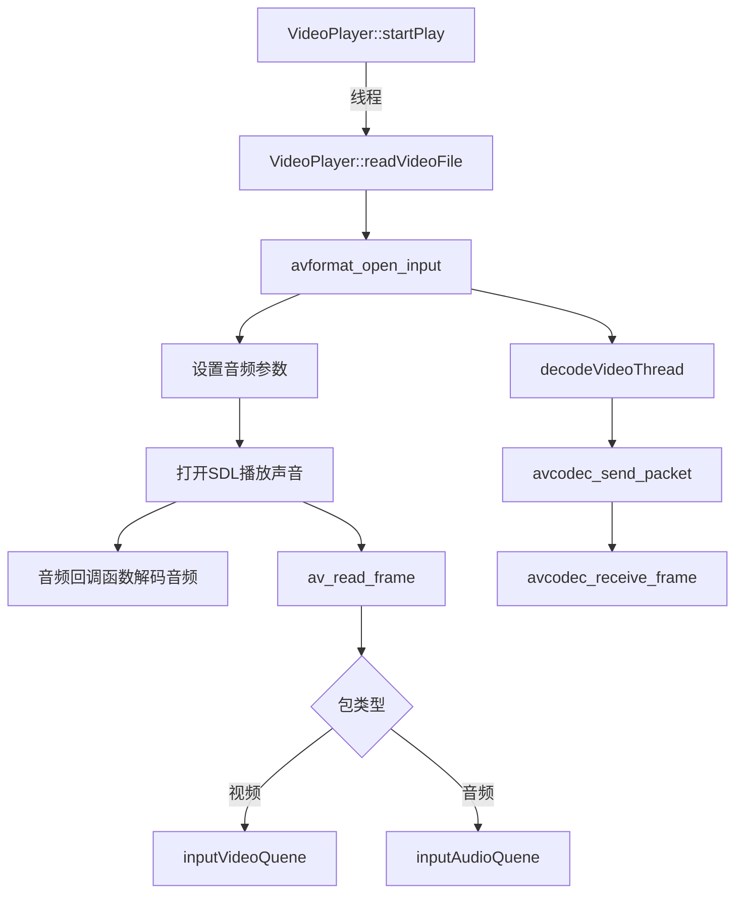

### 调用关系




---

```cpp
#include <libavutil/time.h>

int64_t av_gettime(void);              // 绝对时间戳，微秒
int64_t av_gettime_relative(void);     // 相对单调时间戳，微秒
```

🎯 常见用途

| 场景            | 推荐函数                    | 示例代码片段                                                                                                 |
| ------------- | ----------------------- | ------------------------------------------------------------------------------------------------------ |
| 音视频同步         | `av_gettime_relative()` | `double now = av_gettime_relative() / 1000000.0;` 计算帧显示延迟                                              |
| 性能计时          | `av_gettime_relative()` | `int64_t t0 = av_gettime_relative(); ... printf("cost=%" PRId64 " us\n", av_gettime_relative() - t0);` |
| 需要绝对时间戳（如写日志） | `av_gettime()`          | `int64_t abs_us = av_gettime(); // 可转 time_t`                                                          |

⚠️ 注意点
1. 单位统一：两函数都返回 微秒（1 秒 = 1 000 000 μs）。  
2. 单调性：`av_gettime_relative()` 不会随 NTP 校时、用户手动改系统时间而跳变，更适合做差值。  

---
### openSDL()

这段代码的主要作用是初始化SDL音频系统，找到并打开第一个可用的音频输出设备，并确保设备使用正确的音频格式，为后续通过回调函数播放音频数据做好准备。

1. 函数定义：`int VideoPlayer::openSDL()` 是一个类成员函数，返回值为int类型，用于表示操作是否成功（0表示成功，-1表示失败）。

2. 初始化参数：
   - 创建了两个`SDL_AudioSpec`结构体，`wanted_spec`用于设置期望的音频参数，`spec`用于接收实际打开的音频设备参数
   - 设置了期望的声道数为2（立体声）
   - 采样率设置为44100Hz乘以速度系数（可能用于控制播放速度）

3. 配置音频参数：
   - `wanted_spec.channels`：声道数（2表示立体声）
   - `wanted_spec.freq`：采样频率
   - `wanted_spec.format`：音频格式（AUDIO_S16SYS表示16位有符号整数，系统字节序）
   - `wanted_spec.silence`：静音值（0表示静音）
   - `wanted_spec.samples`：SDL缓冲区大小
   - `wanted_spec.callback`：音频回调函数（用于填充音频数据）
   - `wanted_spec.userdata`：传递给回调函数的数据（这里是当前对象指针）

4. 音频设备操作：
   - 使用`SDL_GetNumAudioDevices(0)`获取可用的音频输出设备数量
   - 遍历所有音频设备，尝试打开每个设备
   - 使用`SDL_OpenAudioDevice`打开设备，如果成功（返回的设备ID大于0）则跳出循环

5. 设备检查：
   - 检查实际打开的音频格式是否与期望的一致
   - 如果不一致，设置音频线程结束标志并返回-1（失败）
   - 最后输出设备ID并返回0（成功）

在 SDL 中配置音频回调函数后，当音频设备需要数据时会**自动调用该回调函数**来获取音频数据，这是 SDL 音频播放的核心机制。

SDL 音频回调函数的参数是固定的，必须严格遵循 SDL 规定的格式，否则会导致编译错误或运行时异常。回调函数的参数包括以下三个：

```c
void SDL_AudioCallback(void* userdata, Uint8* stream, int len);
```

### 各参数的含义：

1. **`void* userdata`**
    
    - 自定义数据指针，用于在回调函数中访问外部数据（如音频缓冲区、播放器状态等）。
    - 该值由 `SDL_AudioSpec` 结构体中的 `userdata` 成员指定（例如 `wanted_spec.userdata = this`）。
    - 在回调函数中，通常需要将其转换为具体类型的指针（如播放器类指针）来使用。
2. **`Uint8* stream`**
    
    - SDL 提供的音频输出缓冲区，回调函数需要将待播放的音频数据写入这个缓冲区。
    - 类型为 `Uint8*`（无符号 8 位整数指针），但实际数据格式由 `SDL_AudioSpec.format` 决定（例如 16 位音频需按 `int16_t*` 处理）。
    - 缓冲区的地址由 SDL 分配和管理，无需手动释放。
3. **`int len`**
    
    - 音频缓冲区的大小（以字节为单位），表示本次回调需要填充的数据量。
    - 回调函数必须确保写入的数据量不超过 `len` 字节，否则会导致缓冲区溢出。
    - 若可用音频数据不足，剩余部分需填充静音（通常用 `0` 填充），避免播放杂音。


这段代码是音频重采样过程中的关键逻辑，用于初始化重采样输出帧（`aFrame_ReSample`）并执行实际的音频重采样操作，最终计算重采样后的音频数据大小。以下是逐部分解释：


### 1. 初始化重采样输出帧（`aFrame_ReSample`）
```c
if (aFrame_ReSample == NULL) {
    aFrame_ReSample = av_frame_alloc();  // 分配AVFrame结构体

    // 计算重采样后的样本数（关键步骤）
    aFrame_ReSample->nb_samples = av_rescale_rnd(
        swr_get_delay(swrCtx, out_sample_rate) + aFrame->nb_samples,
        out_sample_rate, 
        in_sample_rate, 
        AV_ROUND_UP
    );

    // 为输出帧分配音频缓冲区
    av_samples_fill_arrays(
        aFrame_ReSample->data,       // 输出缓冲区指针数组
        aFrame_ReSample->linesize,   // 每个声道的缓冲区大小
        audio_buf,                   // 原始音频数据缓冲区（输入）
        audio_tgt_channels,          // 目标声道数
        aFrame_ReSample->nb_samples, // 目标样本数（上面计算的结果）
        out_sample_fmt,              // 目标音频格式（如AV_SAMPLE_FMT_S16）
        0                            // 对齐方式（0表示默认）
    );
}
```

#### 核心计算：`aFrame_ReSample->nb_samples`
这是重采样输出帧的样本数，通过 `av_rescale_rnd` 计算得出，公式逻辑为：
```
目标样本数 = (延迟样本数 + 输入样本数) × (目标采样率 / 输入采样率)
```
- `swr_get_delay(swrCtx, out_sample_rate)`：获取重采样上下文（`swrCtx`）中的延迟样本数（因重采样算法导致的缓冲延迟）。
- `aFrame->nb_samples`：输入音频帧（`aFrame`）的样本数。
- `out_sample_rate / in_sample_rate`：采样率转换比例（如44100Hz→48000Hz的比例是48000/44100）。
- `AV_ROUND_UP`：向上取整，确保输出缓冲区足够大，避免数据溢出。


### 2. 执行音频重采样
```c
int len2 = swr_convert(
    swrCtx,                  // 重采样上下文（已初始化好参数）
    aFrame_ReSample->data,   // 输出缓冲区（存储重采样后的数据）
    aFrame_ReSample->nb_samples,  // 输出缓冲区可容纳的最大样本数
    (const uint8_t**)aFrame->data,  // 输入音频数据（原始未重采样的数据）
    aFrame->nb_samples       // 输入数据的样本数
);
```
- `swr_convert` 是 FFmpeg 重采样的核心函数，将输入音频（`aFrame`）按 `swrCtx` 配置的参数（采样率、声道数、格式等）转换为目标格式，结果存入 `aFrame_ReSample`。
- 返回值 `len2` 是实际重采样后的样本数（通常等于输入样本数按比例转换后的值）。


### 3. 计算重采样后的数据大小
```c
int resampled_data_size = len2 * audio_tgt_channels * av_get_bytes_per_sample(out_sample_fmt);
audioBufferSize = resampled_data_size;
```
- `av_get_bytes_per_sample(out_sample_fmt)`：获取目标格式每个样本的字节数（如16位音频返回2字节）。
- 总数据大小 = 实际样本数 × 声道数 × 每个样本字节数，即重采样后音频数据的总字节数。
- 最终将结果存入 `audioBufferSize`，用于后续处理（如写入音频缓冲区供播放）。


### 整体作用
这段代码的核心是**将原始音频帧（`aFrame`）转换为目标格式（指定采样率、声道数、位深）**，通过计算合适的输出缓冲区大小、分配内存、执行重采样，最终得到可用于播放的音频数据。这是音视频处理中适配不同设备音频格式的关键步骤（例如将FFmpeg解码出的音频转换为SDL支持的格式）。

---
