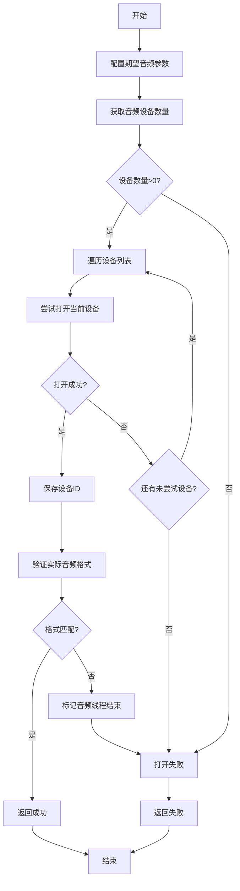

### 调用关系
`VideoPlayer::startPlay`




---

```cpp
#include <libavutil/time.h>

int64_t av_gettime(void);              // 绝对时间戳，微秒
int64_t av_gettime_relative(void);     // 相对单调时间戳，微秒
```

🎯 常见用途

| 场景            | 推荐函数                    | 示例代码片段                                                                                                 |
| ------------- | ----------------------- | ------------------------------------------------------------------------------------------------------ |
| 音视频同步         | `av_gettime_relative()` | `double now = av_gettime_relative() / 1000000.0;` 计算帧显示延迟                                              |
| 性能计时          | `av_gettime_relative()` | `int64_t t0 = av_gettime_relative(); ... printf("cost=%" PRId64 " us\n", av_gettime_relative() - t0);` |
| 需要绝对时间戳（如写日志） | `av_gettime()`          | `int64_t abs_us = av_gettime(); // 可转 time_t`                                                          |

⚠️ 注意点
1. 单位统一：两函数都返回 微秒（1 秒 = 1 000 000 μs）。  
2. 单调性：`av_gettime_relative()` 不会随 NTP 校时、用户手动改系统时间而跳变，更适合做差值。  

---
### openSDL()

这段代码的主要作用是初始化SDL音频系统，找到并打开第一个可用的音频输出设备，并确保设备使用正确的音频格式，为后续通过回调函数播放音频数据做好准备。

1. 函数定义：`int VideoPlayer::openSDL()` 是一个类成员函数，返回值为int类型，用于表示操作是否成功（0表示成功，-1表示失败）。

2. 初始化参数：
   - 创建了两个`SDL_AudioSpec`结构体，`wanted_spec`用于设置期望的音频参数，`spec`用于接收实际打开的音频设备参数
   - 设置了期望的声道数为2（立体声）
   - 采样率设置为44100Hz乘以速度系数（可能用于控制播放速度）

3. 配置音频参数：
   - `wanted_spec.channels`：声道数（2表示立体声）
   - `wanted_spec.freq`：采样频率
   - `wanted_spec.format`：音频格式（AUDIO_S16SYS表示16位有符号整数，系统字节序）
   - `wanted_spec.silence`：静音值（0表示静音）
   - `wanted_spec.samples`：SDL缓冲区大小
   - `wanted_spec.callback`：音频回调函数（用于填充音频数据）
   - `wanted_spec.userdata`：传递给回调函数的数据（这里是当前对象指针）

4. 音频设备操作：
   - 使用`SDL_GetNumAudioDevices(0)`获取可用的音频输出设备数量
   - 遍历所有音频设备，尝试打开每个设备
   - 使用`SDL_OpenAudioDevice`打开设备，如果成功（返回的设备ID大于0）则跳出循环

5. 设备检查：
   - 检查实际打开的音频格式是否与期望的一致
   - 如果不一致，设置音频线程结束标志并返回-1（失败）
   - 最后输出设备ID并返回0（成功）

---
